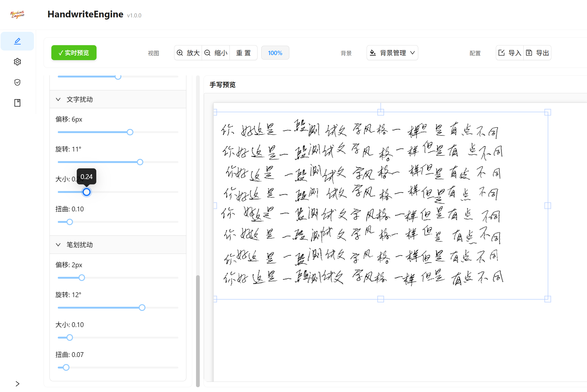
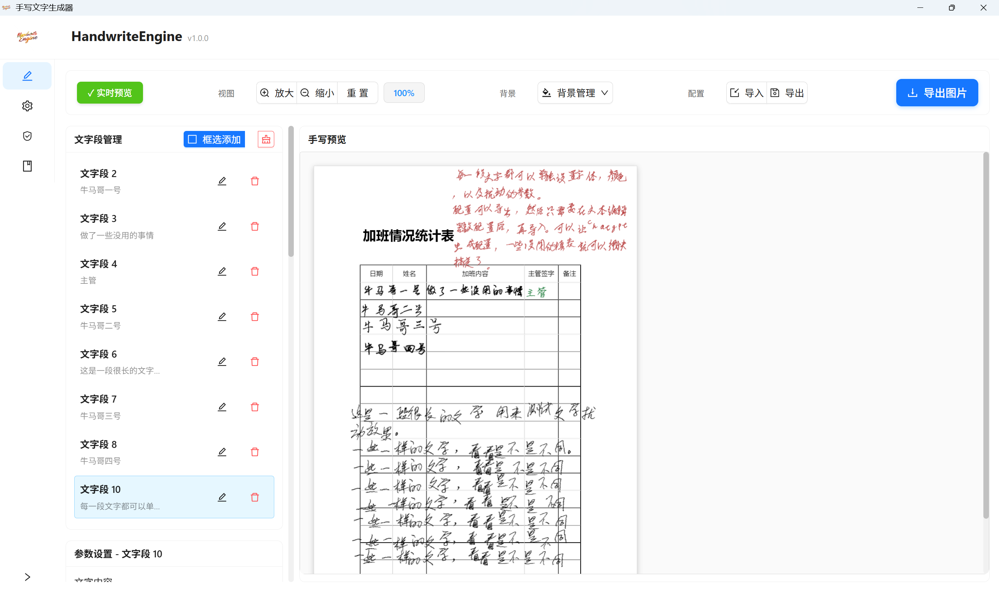

# HandwriteEngine（未开源，这里仅使用文档）
一个基于 Wails3 + React 开发的桌面应用程序，用于将数字文本转换为自然的手写风格文字，支持表单填写、批量处理。  
手写文字生成器桌面应用，支持windows和mac。  
支持试用，试用版有水印。  
参考了网上的开源项目，但是实现上全部是和 cursor 双排写的。  

# 特点
1. 使用 wails 开发。   
2. 绿色免安装，应用程序只有 20M，支持跨平台。  
3. 无需联网也可使用，数据全部在本地，没有隐私问题。  
4. 所有参数范围可以自行调节。支持文字和笔划的偏移、大小、旋转、扭曲。  
5. 每段文字的参数都可以单独设置,支持字体、大小、粗细、颜色、位置、旋转等。  
6. 配置可导入导出。  
7. 支持批量处理配置。（这个功能加大模型很好用） 

# 演示

# 下载地址
通过网盘分享的文件：HandwriteEngine  
链接: https://pan.baidu.com/s/1YpocYxh4AioMq5-uIi8OPQ?pwd=7j5r 提取码: 7j5r  

手写字体网上很多可以下载的。可以找和自己风格比较接近的字体。  
